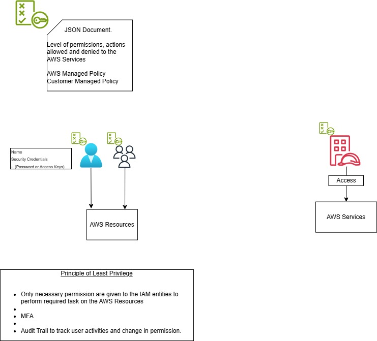

AWS has provided IAM service for Authentication and Authorization.
IAM - Identifty Access Management.

Using IAM, the entities like Users, Groups, Policies and Roles can be created.

Creating a User does Authentication work. The user created will have credentials to login to the AWS account.
Policies provide the authorization to perform action on the AWS resources.

Good Practise is to create a group with some policies attached. Every time a new user joins the organization we can add the user to the group. 
The user will get all the authorization of the group.

Roles - In general roles is used to connect AWS service to applications / services on Premise.
      - It can also be used to connect 2 different AWS accounts.

Interview Questions
-------------------
1. What is AWS Identity and Access Management (IAM)?

2. What are the key components of AWS IAM?

3. How does AWS IAM work?

4. What is the difference between authentication and authorization in AWS IAM?

5. How can you secure your AWS account using IAM?

6. How do IAM users differ from IAM roles?

7. What is an IAM policy?

8. What is the AWS Management Console?

9. How does IAM manage access keys?

10. What is the purpose of IAM groups?

11. What is the role of an IAM policy document?

12. How can you grant permissions to an IAM user?

13. How can you delegate permissions to AWS services using IAM roles?

14. What is cross-account access in AWS IAM?

15. How does IAM support identity federation?

16. What is the purpose of an IAM access advisor?

17. How does IAM enforce the principle of least privilege?

18. What is the difference between IAM policies and resource-based policies?

19. How can you implement multi-factor authentication (MFA) in IAM?

20. What is the IAM policy evaluation logic?

- Q: What is AWS IAM, and why is it important?
- A: IAM - Identity and Access Management System, is a service is access control and security management service proivided by AWS.
   It helps to create and manage entities to access to AWS Resources. This helps only autherized entities can aaccess AWS resources and thus reducing the security risks.
   It is like a security system for the AWS account.

- Q: What is the difference between IAM users and IAM roles?
- A: IAM Users represents individual people or entities that need access to AWS resources. They have their own credentials and typicall associated with long term access.
   IAM Roles is entity provides temporary access usually given to application or AWS Services to perform specific actions on AWS Resources. 
   Roles have associated policies. The actions that can be performed on AWs Resources is controlled by Policies.

- Q: What are IAM policies, and how do they work?
- A: Policy is a JSON documents which has the details of level of permission that is provided to the AWS Service, actions that are allowed and denied. 
   IAM Policy is attached to IAM entities.

- Q: What is the principle of least privilege, and why is it important in IAM?
- A: Principle of least priviledge states that the only enough level permission is to given to IAM entities that is required to complete the task. 

- Q: What is an AWS managed policy?
- A: AWS managed policy is policies are predefined policies that are created and managed by AWS.
